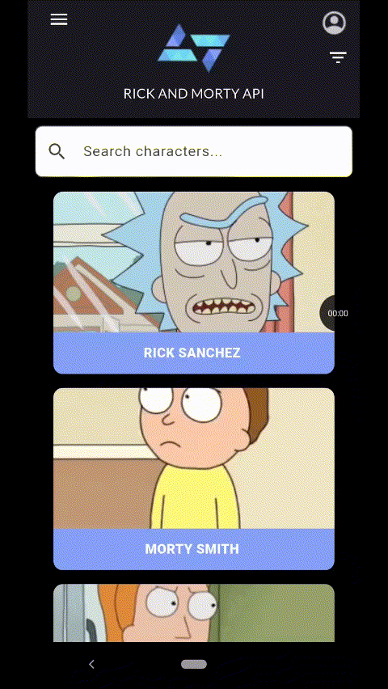
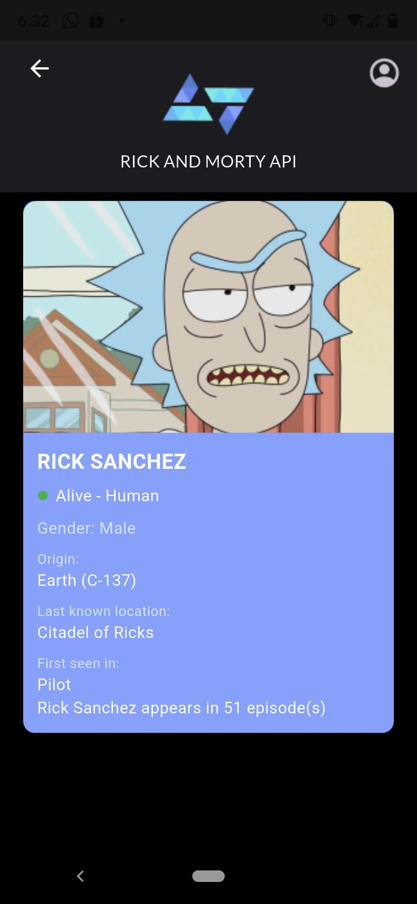
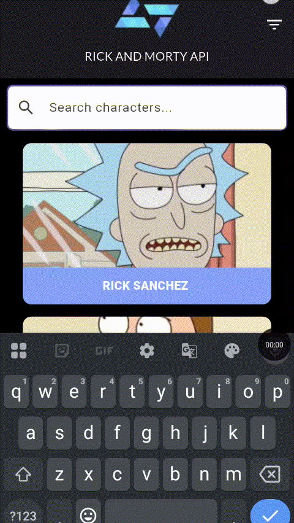
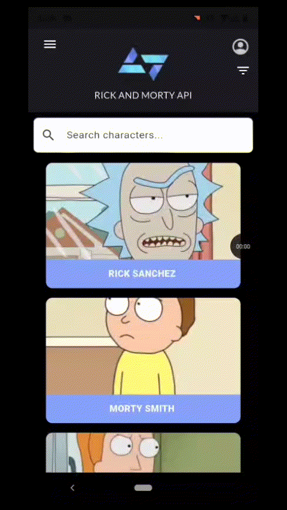

# Rick and Morty App – Kode Start Challenge

Aplicativo Flutter desenvolvido como parte do **Desafio Kode Start**, consumindo a **Rick and Morty API (REST)** para exibir informações sobre personagens da série.  
O app segue o protótipo no Figma e implementa as funcionalidades obrigatórias e opcionais do desafio.

##  Funcionalidades

**Obrigatórias Implementadas**
- Lista de personagens com **scroll infinito**
` é possível ir até o último elemento da lista e voltar até o primeiro usando rolagem`
- Exibição de **nome** e **imagem** nos cards
- Navegação entre lista e detalhe
- Tela de detalhes com:
        - Nome
        - Imagem
        - Espécie
        - Gênero
        - Status
        - Origem
        - Última localização
        - Primeira aparição

**Opcionais Implementadas**
-Número de episódios em que o personagem aparece na tela de detalhes
- Filtro de busca por nome (parcial ou completo) 
`para mostrar toda a lista de personagens novamente basta deixar vazio o campo de busca e confirmar` 
- Filtro via modal por: 
  -Status
  -Gênero 
   (podem ser utilizados juntos)

##  Tecnologias e Bibliotecas

- [Flutter](https://flutter.dev/)
- [Dart](https://dart.dev/)
- [Dio](https://pub.dev/packages/dio) — consumo da API REST
- [Rick and Morty API](https://rickandmortyapi.com/)

##  Demonstração

**Rolagem Infinita**

  

**Navegação para a página de detalhes e de volta a homePage**

  

**Card de personagem detalhado**

  

**Busca por Nome**

  

**Nome não encontrado**

  

**Filtros**

  

**Reset do Filtro**

  

[Link para o vídeo](https://drive.google.com/file/d/1PLXCUB7H0u6MBn3D85yZ4OPJQuBR740_/view?usp=sharing)
 - final da lista : 0:52
 - de volta ao começo da lista : 1:25

## Arquitetura
**AppBar** – Construído com base no que foi apresentado no workshop, na rota de HomePage mostra ícone de menu, User e filtro.  
Na roda de CharacterDetails mostra o ícone de User e o de Voltar para a HomePage.  

**CharacterRepository** – Parte responsável por buscar os dados na API do Rick and Morty.  
`getAllCharacters` retorna uma lista de personagens da API e aceita parâmetros para buscas específicas.  
`getCharacterDetails`: retorna as informações completas de um personagem específico.  

**DetailsPage** – Tela responsável por exibir informações detalhadas de um personagem selecionado na HomePage.  
Exibe imagem, nome, status, espécie, gênero, origem e local atual. A interface utiliza widgets do Flutter, incluindo `SingleChildScrollView` para permitir rolagem, garantindo que todos os detalhes sejam visíveis mesmo em telas menores.  

**HomePage** – Tela inicial da aplicação, responsável por listar os personagens.  
Consome o método `getAllCharacters` do `CharacterRepository` para exibir a lista paginada. Inclui barra de pesquisa e filtros para refinar a listagem, e utiliza `ListView.builder` para renderizar dinamicamente os itens de acordo com os dados recebidos.  

**Models** – Contruídos usando Dart Data Class Generator, deixando somente o necessário para a aplicação (`fromJson` e `toJson`).  

**CharacterCard** – Widget responsável por exibir um cartão simples com nome e imagem.  
É usado em uma HomePage para representar cada personagem da lista, ele também inclui uma estilização visual e uma interação de clique para navegar para uma DetailsPage.  

**DetailedCharacterCard** – Widget responsável por exibir um cartão de personagem com detalhes, fornece mais detalhes sobre o personagem como a imagem, seu nome, status, espécie, gênero, origem e localização atual.  

**FilterModal** – Janela de filtros para buscar personagens por status e gênero.  
Se integra com o `CharacterRepository` pra mostrar os resultados filtrados na HomePage.

---

👨‍💻 Desenvolvido por [Ricardo Lovato](https://github.com/riclovato)

